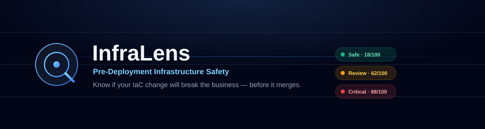
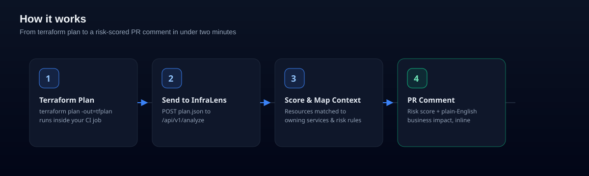
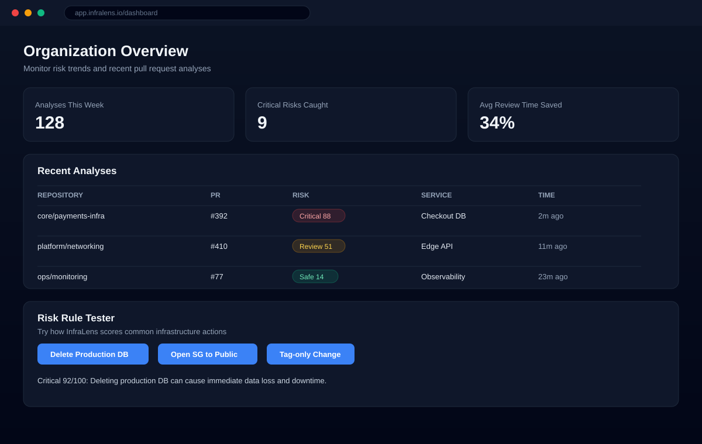

<div align="center">



<p>
  
  
  
  
  
</p>

**Know if your IaC change will break the business — before it merges.**

InfraLens analyzes Terraform plans inside pull requests, scores the change for risk, and explains the business impact in plain English

</div>

---

## What is InfraLens?

Terraform diffs are easy to read; their *consequences* are not. A three-line change to a security group can be harmless — or it can open a production database to the internet. InfraLens sits in your CI pipeline, reads the `terraform plan` output for a pull request, and turns it into a risk score reviewers can actually act on:

- 🟢 **Safe** — no production-impacting changes detected
- 🟠 **Review** — a human should read this closely
- 🔴 **Critical** — high blast-radius change (data loss, public exposure, downtime)

## How it works



1. **Terraform Plan** — your existing CI job runs `terraform plan` as usuals
2. **Send to InfraLens** — the plan JSON is posted to the InfraLens API.
3. **Score & Map Context** — changed resources are matched against risk rules and mapped to the business services they belong to.
4. **PR Comment** — InfraLens posts a single comment with the risk score, affected services, and a plain-English explanation.

**Example PR comment:**

> **InfraLens Analysis Complete**
> 🟠 Review · Risk Score 62/100
> - You are modifying production database security group rules.
> - Public ingress is not added, but existing policy is tightened.
> - Affected service: Billing API.

## Features

| | |
|---|---|
| **Inside Pull Request** | Comments directly on PRs with impact summaries, risk level, and affected services. |
| **Business Context** | Maps cloud resource IDs to service tags for faster reviewer confidence. |
| **Fast Feedback** | Asynchronous processing targets under two minutes from push to comment. |
| **Read-Only by Design** | Runs against a least-privilege, read-only cloud role — InfraLens never performs write actions. |

## Preview



Illustrative preview of the dashboard shown in [`app/dashboard`](app/dashboard/page.tsx) — org-wide risk trends, recent analyses, and a live risk rule tester.

## Tech stack

- [Next.js 16](https://nextjs.org) (App Router) + [React 19](https://react.dev)
- [TypeScript](https://www.typescriptlang.org/)
- [Tailwind CSS 4](https://tailwindcss.com/)
- Docker image, built and pushed via GitHub Actions (see [`.github/workflows/app.yml`](.github/workflows/app.yml))

> **Note:** this repo targets a Next.js build that differs from the version most tooling and training data assume — check `node_modules/next/dist/docs/` for the APIs actually in use before changing framework-level code (see [`AGENTS.md`](AGENTS.md)).

## Getting started

```bash
npm install
npm run dev
```

Open [http://localhost:3000](http://localhost:3000) to view the marketing page, then explore:

| Route | Description |
|---|---|
| `/` | Landing page and example PR analysis |
| `/dashboard` | Org risk overview, recent analyses, and the risk rule tester |
| `/docs` | Quickstart: install the app, wire up CI, configure AWS access |
| `/pricing` | Plan comparison (Hobby / Pro / Enterprise) |

Other scripts:

```bash
npm run build   # production build
npm run start   # serve the production build
npm run lint    # eslint
```

## Connecting a repository

The full walkthrough lives at [`/docs`](app/docs/page.tsx); in short:

1. **Install the GitHub App** on the target repositories with PR read/write access.
2. **Add a CI step** after `terraform plan`:

   ```bash
   terraform init
   terraform plan -out=tfplan
   terraform show -json tfplan > plan.json
   curl -X POST https://api.infralens.io/api/v1/analyze \
     -H "Authorization: Bearer <token>" \
     -H "Content-Type: application/json" \
     -d @plan.json
   ```

3. **Configure a read-only AWS IAM role** — least privilege, no write access required.

## Project structure

```
app/
├── page.tsx              # Landing page
├── layout.tsx            # Root layout, nav, fonts
├── dashboard/
│   ├── page.tsx           # Org overview + recent analyses table
│   └── risk-tester.tsx    # Client-side risk scenario demo
├── docs/page.tsx          # Quickstart integration guide
└── pricing/page.tsx       # Plan comparison
```

## Deployment

Pushes to `main` build a Docker image and publish it to Docker Hub via [`.github/workflows/app.yml`](.github/workflows/app.yml). See [`Dockerfile`](Dockerfile) and [`docker-compose.yml`](docker-compose.yml) for running the image locally.

```bash
docker build -t infralens-web .
docker run -p 3000:3000 infralens-web
```

---

<div align="center">
<sub>Build confidence before deployment.</sub>
</div>
